# Enterprise RAG Operations Agent

## 🚀 Project Overview
This project is a **production-grade Retrieval-Augmented Generation (RAG) and Multimodal system** designed to operate as an autonomous knowledge agent for enterprise environments. Unlike simple chatbots, this system focuses on **explicit orchestration**, **verifiable data ingestion**, and **operational transparency**.

It allows users to ingest complex enterprise documents (PDF, DOCX, TXT, MD, PNG, JPEG), transcribe Audio files (WAV), and crawl dynamic websites, building a unified knowledge base that can be queried with high precision utilizing state-of-the-art vision models, cross-encoders, and audio transcriptions.

### Layer-Wise Architecture Data Flow
*(The following diagram visually maps the precise physical inputs and structural outputs transmitted across each logical layer of the RAG system.)*

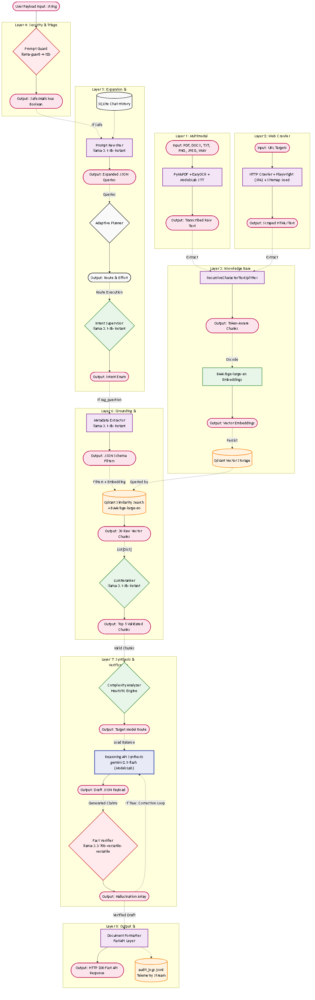

## ✨ Comprehensive Key Features
- **Hardware Agnostics (Auto-Detection)**: The system utilizes advanced runtime probes (`app.infra.hardware`) to instantly adapt its GPU/CPU limits on startup. It ships with custom PowerShell automation scripts that bypass complex Python environment setups, seamlessly detecting and deploying localized CUDA dependencies effortlessly across Windows constraints.
- **Provider API Agnosticism**: Seamlessly decouples backend logic from a single provider. The entire architecture actively supports and cycles between native `Groq`, `OpenAI`, `Anthropic`, and `Gemini` models locally utilizing a dynamic fallback switch map routing natively inside Fast API constraints.
- **Deterministic Multi-Agent Orchestration**: Powered by **LangGraph** to maintain robust `AgentState` dictionaries, strictly preventing runtime hallucinations and bounding LLM logic through an explicit DAG topology.
- **Full Spectrum Multimodality**: Native ingestion and orchestration of Image, Audio, Text, and complex File pathways. Supports visual query understanding (`LLaVA` / `BLIP`), GPU-powered fast OCR (`EasyOCR`), native Audio playback (`Coqui TTS`), and vocal transcription (`Whisper Proxy`).
- **Cross-Encoder Reranking**: Utilizes `bge-reranker-large` locally to semantically filter top-30 low-confidence similarity chunks down to the absolute top 5 most relevant documents, executing a mathematically pristine `Math Sigmoid` filter.
- **Adaptive Execution Planner**: Advanced node interceptor actively deciding optimal reasoning models, bounding deep metrics explicitly mapping heavy 120B+ models natively only when heuristic boundaries are explicitly exceeded by `ComplexityClassifier` logic arrays.
- **RLAIF Hallucination Correction Loop**: Sovereign Verifier bounds. Draft generations flagged (`is_hallucinated=True`) systematically route through a forced error-correction execution DAG natively suppressing loose citations dynamically.
- **Micro-Model Supervisor Routing**: Triages user intent instantly (<0.0s) using high-speed, lightweight models (`llama-3.1-8b-instant`) to either bypass the database for smalltalk or engage the heavy RAG analytics.
- **Independent Fact Verification**: Secondary LLM logic (`Sarvam M`) acts as a sovereign auditor, redacting claims generated by the Core Brain (`llama-3.3-70b-versatile`) if they cannot be verified against the native source text.
- **Dynamic Multi-Source Ingestion**: Asynchronously processes standard enterprise documents and executes deep web-crawls using headless **Playwright** browsers to extract dynamic text from JavaScript-heavy Single Page Applications (SPAs).
- **Decoupled Application Persistence**: Completely decoupled conversational tracking utilizing `SQLite` histories scaling automatically globally isolated from frontend UI states.
- **Enterprise Traceability**: Fully embedded telemetry engine exporting detailed JSONL audit logs capturing token densities (`tokens_input/output`), execution latencies natively mapped to components, RLAIF Reward bounds, Hardware probes, and hallucination verdicts.

## 🏗️ Project Architecture

```text
enterprise-rag-agent/
│
├── app/                      # Enterprise Vertical Slice Architecture
│   ├── api/                  # HTTP layer ONLY (FastAPI endpoints, swagger definitions)
│   │   ├── __init__.py
│   │   └── routes.py         # Core endpoints (/chat, /ingest/files, /ingest/crawler, /feedback).
│   │
│   ├── core/                 # Cross-cutting primitives
│   │   ├── __init__.py
│   │   ├── rate_limit.py     # TokenBucket in-memory rate limiter protecting external HTTP endpoints.
│   │   ├── telemetry.py      # ObservabilityLayer emitting TelemetryLogRecord metrics natively to JSONL.
│   │   └── types.py          # Global Pydantic typed dictionaries (AgentState, TelemetryLogRecord).
│   │
│   ├── supervisor/           # ReAct brain (Router map, Intent Detector, Adaptive Planner)
│   │   ├── __init__.py
│   │   ├── intent.py         # Semantic Intent Classifier (llama-3.1-8b) routing queries.
│   │   ├── planner.py        # Adaptive Planner intercepting paths, controlling dynamic routing.
│   │   └── router.py         # ExecutionGraph DAG Controller piping data through prompting flows.
│   │
│   ├── prompt_engine/        # Guardrails & Prompts
│   │   ├── __init__.py
│   │   ├── guard.py          # PromptInjectionGuard (llama-prompt-guard-2) short-circuiting malicious injections.
│   │   ├── rewriter.py       # PromptRewriter (gpt-oss-120b) mathematically interpolating ambiguous inputs.
│   │   └── templates.py      # Static prompt strings.
│   │
│   ├── ingestion/            # Full Data Pipeline
│   │   ├── __init__.py
│   │   ├── chunker.py        # RecursiveCharacterTextSplitter strictly matching hardware encoding limits.
│   │   ├── crawler_service.py # Scalable headless Playwright worker intelligently scraping SPA Javascript.
│   │   ├── loader.py         # PyMuPDF extraction engine parsing physical PDF/DOCX layouts.
│   │   └── pipeline.py       # IngestionPipeline orchestrator syncing chunks into Qdrant.
│   │
│   ├── retrieval/            # Search Mechanics
│   │   ├── __init__.py
│   │   ├── embeddings.py     # Hardware-aware EmbeddingModel (BAAI/bge-large-en).
│   │   ├── hybrid_search.py  # Optional BM25 lexical reranker over dense embeddings.
│   │   ├── metadata_extractor.py # JSON extractor creating Qdrant $eq filtering bounds.
│   │   ├── reranker.py       # Cross-Encoder (bge-reranker-large) isolating the exact Top-5 semantic chunks via Sigmoid Math.
│   │   └── vector_store.py   # Persistent QdrantStore adapter ensuring isolated multi-tenant Cloud interactions.
│   │
│   ├── multimodal/           # Multi-Sensory Hub (Vision, OCR, TTS)
│   │   ├── __init__.py
│   │   ├── file_parser.py    # Advanced extraction multiplexer bridging PyMuPDF and EasyOCR seamlessly.
│   │   ├── vision.py         # Dynamic VL proxy switching natively between High VRAM (LLaVA) and Low VRAM (BLIP).
│   │   ├── tts.py            # Local Coqui TTS model bound for ultra-fast, offline synthesized outputs.
│   │   └── multimodal_router.py # Orchestrator piping parsed payloads directly into Qdrant ephemeral pools.
│   │
│   ├── agents/               # Execution Workers
│   │   ├── __init__.py
│   │   ├── coder.py          # Code-Specialized analytical MoE mapped to qwen-32b.
│   │   └── rag.py            # Orchestrator chaining Extraction -> Rerank -> Adaptive Synthesis -> Fact Verification -> RLHF.
│   │
│   ├── reasoning/            # Core Logic Brain
│   │   ├── __init__.py
│   │   ├── complexity.py     # Low-latency classifier measuring heuristics to trigger dynamic model synthesis overrides.
│   │   ├── formatter.py      # ResponseFormatter mapping Streamlit UI visual citations.
│   │   ├── synthesis.py      # SynthesisEngine executing context-bound responses.
│   │   └── verifier.py       # HallucinationVerifier (Sarvam M) actively redacting unsourced claims.
│   │
│   ├── rlhf/                 # Data Flywheel (Telemetry)
│   │   ├── __init__.py
│   │   ├── feedback.py       # RLHF structural API payload validations.
│   │   ├── feedback_store.py # SQLite Feedback routines binding user Thumbs-Up metrics natively to session IDs.
│   │   └── reward_model.py   # Automatic RLAIF generation executing a validation math array.
│   │
│   ├── infra/                # Systems Infrastructure
│   │   ├── __init__.py
│   │   ├── celery_app.py     # Background worker instances and configurations.
│   │   ├── celery_tasks.py   # Bound ingestion crawler routines for threading.
│   │   ├── database.py       # Native SQLite database strictly bounding App Ingestion Trackers.
│   │   ├── hardware.py       # HardwareProbe measuring core execution matrices (CPU/CUDA patches).
│   │   ├── job_tracker.py    # SQLite worker tracker tracking Celery ingest states.
│   │   ├── model_bootstrap.py # Cold-start interceptor caching heavy HuggingFace/TTS binary footprints.
│   │   ├── provider_router.py # Routing bindings mapping APIs dynamically across multiple external SaaS tools.
│   │   ├── qdrant_patch.py   # Deep connection patches extending Qdrant bounds.
│   │   ├── redis.py          # Distributed rate-limiting stub for scaled persistence blocks.
│   │   └── otel.py           # OpenTelemetry loops wrapper.
│   │
│   ├── evals/
│   │   ├── __init__.py
│   │   └── ragas_runner.py   # Automated unit tests and execution bounds mapping.
│   │
│   └── main.py               # The Core Uvicorn Execution Gateway script mapping all routes.
│
├── frontend/                 # User Interface
│   └── app.py                # Streamlit Dashboard acting purely as a thin-client HTTP bridge.
│
├── scripts/                  # Hardware-Agnostic Execution Automation
│   ├── bootstrap_env.ps1     # Native virtual environment installer and system dependency fixer.
│   ├── full_reset_and_bootstrap.ps1 # The MASTER execute script. Rebuilds venv, wipes caches, installs architecture.
│   ├── start_api.ps1         # Standalone FastAPI Uvicorn engine execution script ensuring explicit PYTHONPATH.
│   ├── start_celery_worker.ps1 # Standalone worker initialization for concurrent playright background crawls.
│   └── start_stack.ps1       # Concurrent multiplexer triggering `start_api` and `start_celery_worker` simultaneously.
│
├── data/                     # Root Data Persistence Storage
│   ├── crawled_docs/         # Scraped Playwright raw textual outputs.
│   ├── uploaded_docs/        # User manual file uploads holding zone.
│   ├── qdrant_storage/       # Internal decoupled Qdrant binary persistence chunks.
│   ├── audit/                # Persistent JSONL telemetry strings.
│   └── crawler_data.db       # Database explicitly mapping and saving crawl execution footprints locally.
│
├── assets/                   # Compiled System Renderings and DLLs
│   ├── architecture_*.png    # Rendered Mermaid diagrams detailing data flow architecture visually.
│   └── VC_redist.x64_2013_2017_to_2026.rar # Crucial C++ physical payload for Windows binary compatibility.
│
├── .env / .env-copy          # Logic maps & Provider variables
├── .gitignore
├── README.md
└── requirements.txt
```

## 🛠️ Technology Stack

| Component | Tech | Reason for Choice/Location |
| :--- | :--- | :--- |
| **Language** | Python 3.11 | Industry standard for AI/ML engineering. |
| **Orchestration** | LangGraph | State-based multi-agent orchestration for robust NLP routing. |
| **Frontend** | Streamlit | Rapid prototyping and interactive data visualization. |
| **Backend** | FastAPI | High-performance, async-native REST API (Headless SaaS Architecture). |
| **Background Queue**| Celery & Redis | Essential for isolating long-running, heavy Playwright website crawls and PDF tokenization operations from blocking the live FastAPI HTTP thread natively. |
| **Core Brain LLM**| `sarvam` / `groq` / `openai` / `anthropic` | Completely agnostic logic controller dynamically delegating API queries at runtime to prevent vendor lock-in. |
| **Multimodal OCR**| `EasyOCR` | PyTorch-native optical scanner ensuring perfect compatibility with local GPU architectures without relying on C++ heavy binaries like paddle. |
| **Visual LLM**| `llava-1.5-7b` & `blip-base` | Twin-engine logic bounding deep reasoning image inference onto 12GB VRAM environments or failing completely backward safely onto 4GB BLIP footprints implicitly. |
| **Agent / Speed LLM**| `llama-3.1-8b-instant` | Near-instantaneous intent routing and JSON-mode metadata extraction logic. |
| **Independent Verifier**| Sarvam AI (`sarvam-m`) | Secondary independent LLM layer to mathematically verify fact citations avoiding implicit bias. |
| **Code Execution**| Groq (`qwen/qwen3-32b`) | Purpose-built analytical MoE strictly handling codebase logic routing. |
| **Embeddings** | BAAI/bge-large-en-v1.5 + Cross-Encoder | State-of-the-art open-source semantic generation. |
| **Vector Store** | Qdrant | Scalable cloud-first vector index natively separating ephemeral multimodality sessions from global corporate scopes. |
| **PDF Processing** | PyMuPDF (fitz) | Fastest and most accurate text extraction for PDFs. |
| **Web Crawling** | **Playwright** + BeautifulSoup | Handles client-side JS rendering for modern SPAs. |

---

## 🚀 Installation & Usage

### ⚠️ Critical Prerequisites for Windows Users
If running on Windows, you **MUST** install the **Microsoft Visual C++ Redistributables (2015-2022)** before running the setup. Failure to do so will result in unrecoverable `[WinError 127]` DLL crashes due to PyTorch, SentenceTransformers, and EasyOCR expecting native C++ architecture libraries that do not exist out-of-the-box on Windows 11.
*(A packaged installer `VC_redist.x64_2013_2017_to_2026.rar` is available in the `/assets/` directory for immediate use).*


### Phase A: Environment Setup (`.env`)
You must define the exact `.env` configuration file in the primary project root mapping the necessary API keys and boolean limits before booting. *Below is the required `.env-copy` format:*

```env
# -----------------------------------------------------------------------------
# Production-Ready Environment Template (.env-copy)
# -----------------------------------------------------------------------------
# Copy this file to .env in your deployment environment and fill values.

# --- SaaS API Intelligent Routing Configuration ---
CORE_LLM_PROVIDER=sarvam
VISION_LLM_PROVIDER=gemini
AUDIO_LLM_PROVIDER=faster-whisper

# --- API & Authentication Keys ---
HF_TOKEN=your_hf_token_here

# 🟢 FREE-TIER API / ZERO COST KEYS
GEMINI_API_KEY=your_gemini_api_key_here
GROQ_API_KEY=your_groq_api_key_here

# 🔴 PAID ENTERPRISE API KEYS
SARVAM_API_KEY=your_sarvam_api_key_here
OPENAI_API_KEY=your_openai_api_key_here
ANTHROPIC_API_KEY=your_anthropic_api_key_here

# --- Qdrant Vector Store --
QDRANT_URL=your_qdrant_cloud_url_here
QDRANT_API_KEY=your_qdrant_cloud_key_here
QDRANT_MULTI_TENANT=false
QDRANT_COLLECTION=enterprise_rag

# --- Feature Flags ---
HYBRID_SEARCH=true
ENABLE_TRANSCRIBE=true
PRELOAD_MODELS=true
OTEL_ENABLED=false

# --- Model & Hardware Paths ---
MODEL_CACHE_DIR=D:\WorkSpace\Enterprise-RAG-Operations-Agent_POC\model-cache
HF_HUB_DISABLE_SYMLINKS_WARNING=1

# --- Multimodality Configuration ---
OCR_ENGINE=easyocr
OCR_LANG=en
VISION_BACKEND=blip           # Use 'llava' for High VRAM, 'blip' for Low VRAM (4GB) 
VISION_MODEL_NAME=Salesforce/blip-image-captioning-base
VISION_FALLBACK_MODEL=Salesforce/blip-image-captioning-base
VISION_ALLOW_FALLBACK=true

# --- Celery + Redis (Background Ingestion) ---
CELERY_ENABLED=true
CELERY_BROKER_URL=redis://your_redis_broker_url:6379/0
CELERY_RESULT_BACKEND=redis://your_redis_backend_url:6379/0
CELERY_AUTOSTART=true

# Auto-fix system deps (Windows only). Installs VC++ Redistributable and reinstalls torch if needed.
AUTO_FIX_SYSTEM_DEPS=true

# --- Provider Auto Routing (optional) ---
PROVIDER_AUTO_ROUTING=false
PROVIDER_AUTO_PRIORITY=groq,openai,anthropic,gemini

# --- CORS & Ephemeral Config ---
CORS_ALLOW_ORIGINS=https://your-frontend.example.com
CORS_ALLOW_CREDENTIALS=false
EPHEMERAL_TTL_HOURS=24
EPHEMERAL_CLEANUP_INTERVAL_MINUTES=60
MAX_UPLOAD_MB=20
```

### Phase B: Zero-Friction Application Execution
We completely rewrote the execution pipeline into an automated PowerShell suite. You do not need to manually create `venv` folders or inject `PYTHONPATH` strings. 

Open a PowerShell terminal at the repository root and execute the **Master Blueprint Script**:
```powershell
powershell -ExecutionPolicy Bypass -File .\scripts\full_reset_and_bootstrap.ps1
```

**What exactly does `full_reset_and_bootstrap.ps1` do line-by-line?**
1. **[Lines 6-12]** Scans Windows WMI modules to violently kill any active zombie `uvicorn`, `python.exe`, or `celery` worker processes that belong to this system path, ensuring a 100% clean socket port structure.
2. **[Lines 14-30]** Deep deletes the existing `./venv`, the `./model-cache`, the local `./data/qdrant_storage`, and aggressively purges the system-wide `pip cache`.
3. **[Lines 32-38]** Physically regenerates a pristine `python -m venv` sandbox explicitly mapped to your underlying architecture and forces a raw download of all libraries inside `requirements.txt`.
4. **[Line 42]** Triggers the `bootstrap_env.ps1` sub-script. (This downloads NLTK architectures, initializes Spacy variables, preloads 5GB+ hugging face tokenizers safely sequentially, and executes `.dll` environment probing natively fixing PyTorch CUDA misalignments before they occur). 
5. **[Line 46]** Hands ultimate control over to `start_stack.ps1` to execute the system binaries concurrently.

**What happens inside `start_stack.ps1` line-by-line?**
1. **[Lines 4-10]** Validates the core root binaries, resolves the physical Python path inside `venv\Scripts\python.exe` preventing system leakage, and violently spins up `start_api.ps1` on an isolated background PowerShell thread. 
2. **[Lines 11-16]** Evaluates your `.env` configuration. Since `CELERY_AUTOSTART=true` is flagged, it synchronously initiates a secondary parallel PowerShell thread executing `start_celery_worker.ps1`. 

*(For transparency: `start_api.ps1` forces `PYTHONHOME` mapping and executes `uvicorn app.main:app --port 8000`. Concurrently, `start_celery_worker.ps1` forces the same environment map and invokes `celery -A app.infra.celery_app worker --pool=solo` ensuring Playwright crawls do not crash concurrent threads on Windows.)*

**The final human step:**
Now that your API + Redis Workers are running, simply open a **new** terminal:
```bash
venv\Scripts\activate
streamlit run frontend/app.py
```
✅ Access the Chat portal at `http://localhost:8501`

### Phase C: FastAPI's Swagger /Docs Endpoint Configuration
Because the backend was developed strictly in a headless, headless architecture format, every interaction with the LLM natively routes through the FastAPI endpoints.

You can physically inspect, test, and manipulate every operational payload locally by visiting: 
**`http://localhost:8000/docs`**

**Critical Operational Endpoints Explained:**
1. **`POST /api/v1/chat`** 
   - **What it does:** The absolute core of the engine. It parses text, file uploads, audio, and visual nodes, mapping them into the 11-step LangGraph executor.
   - **Toggles & Inputs:**
     - `query` (text input): What you are asking the LLM (e.g. "Summarize the report").
     - `files` (file array): Accepts PNG, JPEG, PDF, DOCX, TXT. Will dynamically route logic based on formats.
     - `audio_input` (file): Accepts a WAV file, forces STT transcription overriding the `query`.
     - `model_provider` (dropdown text): Select `auto` to trigger dynamic overrides, or strictly lock to `groq`, `anthropic`, `openai`, `gemini`. Changing this physically routes the core logical reasoning logic through a different remote SaaS.
     - `image_mode` (dropdown text): Toggle `ocr` to extract exact texts from an image using `EasyOCR`, or toggle `vision` to have `LLaVA` visually interpret the image semantically.
     - `reranker_profile` (dropdown text): Changing this switches between Cross-Encoders. Select `off` to bypass the Math Sigmoid logic and process RAG 3x faster, or `accurate` to ensure the strictest data provenance limits.
     - `stream` (boolean toggle): Toggle True for visual HTTP SSE streaming bits (mimicking ChatGPT), toggle False to wait for a monolithic final payload completion.
   - **Outputs:** An Enterprise JSON structure returning the `answer`, citations, provenance vectors, and complete `audit_logs` matrices outlining the speed/cost variables.

2. **`POST /api/v1/ingest/crawler`**
   - **What it does:** Triggers a background Celery pipeline to deploy Headless Playwright workers against a target Domain URI.
   - **Inputs:** `start_url` (text input string), `max_pages` (integer defining crawl limits).
   - **Outputs:** Returns a `task_id` dynamically tracking the background queue. It does NOT return crawled text explicitly.

3. **`POST /api/v1/ingest/files`**
   - **What it does:** Securely takes enormous documents and deposits them into the global Qdrant base, separating them entirely from ephemeral session chat logic.
   - **Inputs:** `files` array (accepts complex multi-megabyte PDFs).
   - **Outputs:** Returns a Job Tracker URI tracking the physical tokenization chunks.

---

## 📈 Integration Phases 1-9

### ✅ Phase 1: Ingestion Engine
**Goal:** Build a robust, fault-tolerant ingestion pipeline strictly isolated within the `app/ingestion/` vertical slice.
- Migrated physical document loaders (`PyMuPDF`) and web scrapers into a unified ingestion stream.
- Handled complex SPA crawling natively via a highly concurrent **Playwright** implementation.
- Integrated `RecursiveCharacterTextSplitter` to handle LLM token-aware sliding window data segmentation perfectly sized for embedding buffers.

#### 🏗️ Architecture (Phase 1)


### ✅ Phase 2: Embeddings & Qdrant Vector Store
**Goal:** Transition entirely to a managed Cloud Vector Database (Qdrant) and implement Cross-Encoder Reranking inside `app/retrieval/`.
- Executed strict L2 Cosine Distance mapping via `BAAI/bge-large-en-v1.5` embeddings natively routed to the GPU core.
- Implemented `bge-reranker-large` inside `app/retrieval/reranker.py` to evaluate the Top 30 vectors and return strictly the Top 5.
- Completely abandoned legacy FAISS persistence in favor of native Qdrant payloads for enterprise multi-tenancy.

#### 🏗️ Architecture (Phase 2)


### ✅ Phase 3 & 4: Agentic Architecture Overhaul
**Goal:** Remove fragile procedural RAG scripts and replace them with a LangGraph multi-agent orchestrator resilient to logical exceptions.

#### 🏗️ Architecture (Phase 3 & 4)


*(The top section of the diagram illustrates the **Phase 4 Agent Implementations**, including the high-speed Groq Supervisor routing intent dynamically. The bottom section illustrates the **Phase 3 RAG Agent Refactoring**, decoupling the vector grounded extraction and synthesis into isolated LangGraph worker nodes natively in `app/agents/`.)*

#### 🛠️ Step-by-Step Implementation
1.  **State Management (LangGraph):**
    -   Implemented a strictly typed `AgentState` dictionary globally mapping `app/core/types.py`.
    -   Secures LLM conversational history organically across multi-turn sessions, bounding the schema execution.
    -   Exposes `latency_optimizations` metrics tracing the autonomous model routing.
2.  **Supervisor Semantic Routing:**
    -   Configured the `app/supervisor/intent.py` module using `llama-3.1-8b-instant` for explicit instant triage.
    -   Seamlessly switches execution paths between bypassing retrieval for smalltalk or initiating exhaustive agentic queries.
3.  **Specialized Domain Execution Agents:**
    -   **Smalltalk Bypass:** Natively routes via `app/supervisor/router.py` executing instant responses without querying Qdrant.
    -   **RAG DAG Execution:** Initiates `app/agents/rag.py` to chain retrieval, dynamic synthesis (routing `70B` or `120B` depending on complexity), and verification (`Sarvam`).
4.  **UI Alignment & Optimization:**
    -   Streamlit UI explicitly mapped to visually render the deep execution graphs dynamically as they execute in the backend.
    -   Silenced huggingface PyTorch tensor initialization outputs to keep system logs enterprise-clean.

### ✅ Phase 5 & 6: API-Agnostic Agentic Architecture Overhaul
**Goal:** Remove fragile procedural RAG scripts and replace them with a provider-agnostic LangGraph multi-agent orchestrator resilient to logical exceptions.

**Why did we build this?**
The initial system hard-coded responses across singular platforms (Groq exclusively), resulting in fatal total system outages during API downtime limits. Furthermore, simple procedural `.py` scripts failed violently if an LLM hallucinated its execution schema array.
**How and Where was this implemented?**
- We configured a strictly typed, globally available `AgentState` node mapping inside `app/core/types.py`. This ensures every node reads from a fault-tolerant Pydantic class object.
- Replaced the hard-coded model invocations inside `app/agents/rag.py` and `app/supervisor/router.py` with dynamic provider agnostic engines that evaluate the payload context. The engine natively routes queries across Anthropic/OpenAI/Groq instantly upon failure using dynamic Python `get_provider()` routines. 

#### 🏗️ Architecture (Phase 5 & 6)
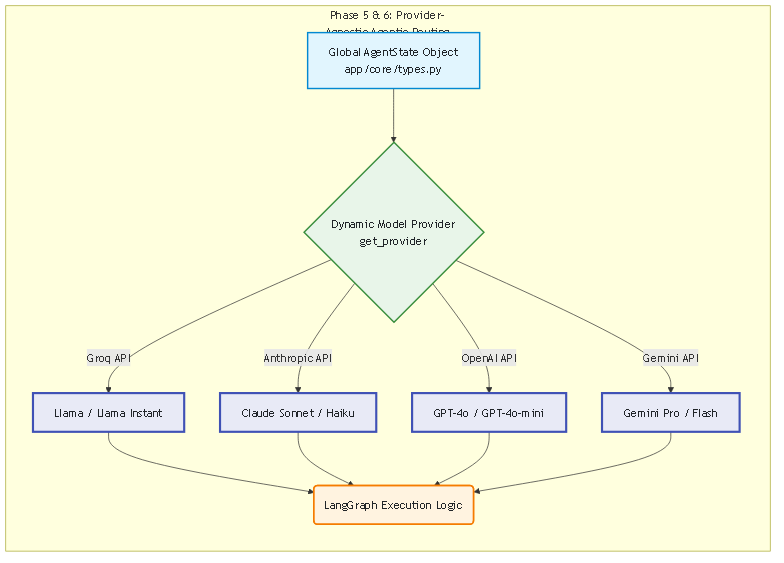


### ✅ Phase 7: API-First Decoupling & SaaS Dependency Validation
**Goal:** Transition entirely into a fully headless, vertical-slice architecture where HTTP interfaces strictly decouple from core logic.

**Why did we build this?**
To ensure third-party enterprise integrations (like Slack, Microsoft Teams, and automated pipelines) could natively hook into the RAG array without ever relying on the Streamlit UI application constantly running and tying up physical memory.
**How and Where was this implemented?**
- Migrated all UI logic explicitly out of the backend bounds, stripping away session UI constraints. The Streamlit script natively deployed in `/frontend/app.py` acts strictly as an HTTP Client mapping secure RESTful queries.
- Established `app/api/routes.py` to handle all inbound REST bounds. We engineered explicit Pydantic response/request models (`ChatRequest`, `IngestionResponse`) enabling automatic Swagger documentation and Type-Level payload sanitization arrays, assuring any frontend injection exploits fail securely before reaching the logic.

#### 🏗️ Architecture (Phase 7)
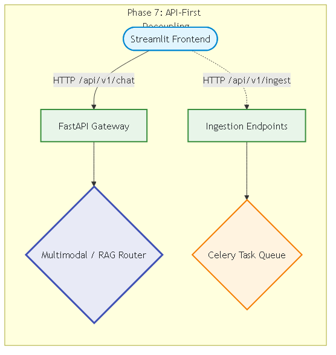


### ✅ Phase 8 & 9: Enterprise Telemetry & Distributed Databases
**Goal:** Establish sovereign accountability loops auditing every node within the LangGraph DAG, alongside validating the knowledge extraction schemas securely against Cloud database architectures.

**Why did we build this?**
FAISS local flat-file databases crash concurrently on highly scaled networks natively. Additionally, unregulated LLM RAG pipelines consistently fabricate convincing answers that go totally unnoticed locally, requiring an automated validation matrix.
**How and Where was this implemented?**
- Completely replaced `vector_store.py` logic natively pointing generated extraction embeddings strictly at remote Qdrant Cloud structures supporting vast concurrent operations safely.
- Injected an active sovereign Fact Verification logic matrix inside `app/reasoning/verifier.py`. This explicitly executes a secondary, cheaper LLM operation that mathematically traces every single answer sentence against the raw document source. It then maps directly into a JSONL Telemetry pipeline in `app/core/telemetry.py` ensuring hallucinations are securely detected and tracked before reaching the User interface.

#### 🏗️ Architecture (Phase 8 & 9)
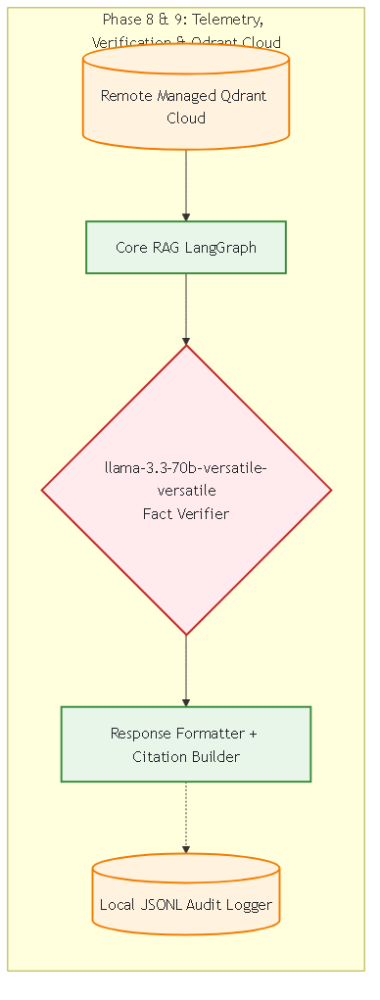

---

## 🏗️ Phase 10: The Complete 11-Step RAG Agentic Architecture

`Architecture`

Below represents the exhaustive integration of the enterprise RAG standards we implemented natively into the LangGraph execution flow, strictly isolating vector similarity from intelligent reasoning.

1. **Prompt Injection & Safety Guard:** Protects the execution graph from system prompt extraction and RAG poisoning using `llama-prompt-guard-2-86m`.
2. **Prompt Rewriter / Query Expansion:** Mathematically expands ambiguous user queries natively utilizing `openai/gpt-oss-120b` (wrapped with defensive regex parsing for exact JSON stability).
3. **Intent Detection Supervisor:** A high-speed classifier (`llama-3.1-8b-instant`) strictly routing the execution state without blocking the async API loop.
4. **Agent Dispatch / Smalltalk Bypass:** Routes trivial greetings to a lightweight responder, bypassing the expensive vector database.
5. **Dynamic Metadata Extraction:** Leverages `llama-3.1-8b-instant` to stably parse the user's natural language into strict JSON `$eq` filters, mapping directly to Qdrant payloads.
6. **Vector Similarity Search (Top 30):** Executes a high-recall L2 Cosine Distance search utilizing `BAAI/bge-large-en-v1.5` embeddings on the GPU.
7. **Cross-Encoder Reranking (Top 5):** Evaluates the top 30 chunks through a rigorous semantic cross-encoder algorithm. We strictly apply a Math Sigmoid Activation function `1 / (1 + math.exp(-logit))` to transform raw pipeline logits into bounds checking >0.35 probability before truncating down to Top 5.
8. **Core Reasoning Synthesis (Dynamic Routing):** A discrete Complexity Analyzer logic gate dictates generation. If the query exhibits intense reasoning demands (Word counts >40 or multi-hop logic gates like "contrast/analyze"), execution overrides instantly to `openai/gpt-oss-120b`. Otherwise, it falls back to the low-latency `llama-3.3-70b-versatile`.
9. **Independent Fact Verifier:** A sovereign model (`Sarvam M`) audits the generated text line-by-line exclusively against the source chunks, redacting unsourced claims natively mapping visually onto UI strikethroughs.
10. **Formatter & Citation Modeler:** Injects physical markdown URL and Document links natively into the structured stream response for Streamlit UI rendering.
11. **Telemetry & RLHF Auditing:** Traps latency matrices, token bounds, dynamic routing models, and hallucination verdicts natively into the `audit_logs.jsonl` pipeline.

### Visual Architecture Diagram (The Execution DAG)


### Strict Step-By-Step Execution Flow

To ensure complete understanding of the pipeline's deterministic routing, here is the exact input/output life cycle of a conversational turn:

1. **Prompt Injection & Safety Guard:** Protects the execution graph from system prompt extraction and RAG poisoning using `llama-prompt-guard-2-86m`.
   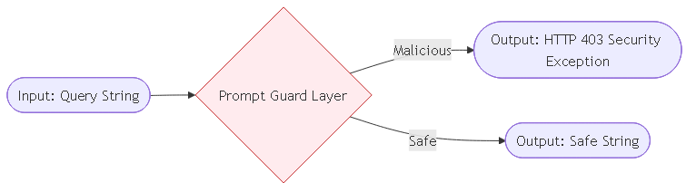
2. **Prompt Rewriter / Query Expansion:** Mathematically expands ambiguous user queries natively utilizing `openai/gpt-oss-120b` (wrapped with defensive regex parsing for exact JSON stability).
   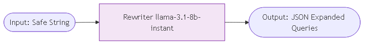
3. **Intent Detection Supervisor:** A high-speed classifier (`llama-3.1-8b-instant`) strictly routing the execution state without blocking the async API loop.
   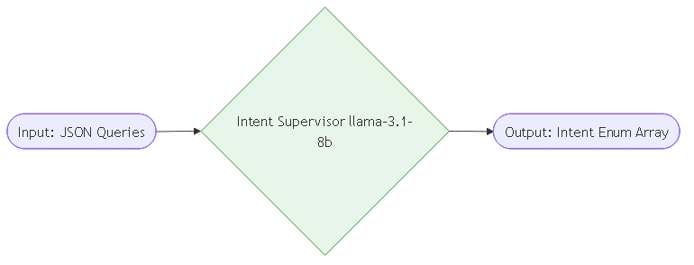
4. **Agent Dispatch / Smalltalk Bypass:** Routes trivial greetings to a lightweight responder, bypassing the expensive vector database natively mapping.
   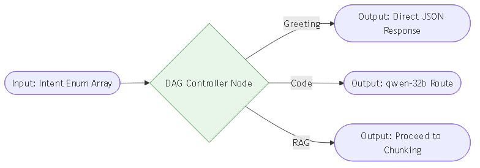
5. **Dynamic Metadata Extraction:** Leverages `llama-3.1-8b-instant` to stably parse the user's natural language into strict JSON `$eq` filters, mapping directly to Qdrant payloads.
   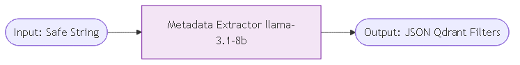
6. **Vector Similarity Search (Top 30):** Executes a high-recall L2 Cosine Distance search utilizing `BAAI/bge-large-en-v1.5` embeddings on the GPU.
   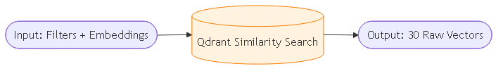
7. **Cross-Encoder Reranking (Top 5):** Evaluates the top 30 chunks through a rigorous semantic cross-encoder algorithm. We strictly apply a Math Sigmoid Activation function `1 / (1 + math.exp(-logit))` to transform raw pipeline logits into bounds checking >0.35 probability before truncating down to Top 5.
   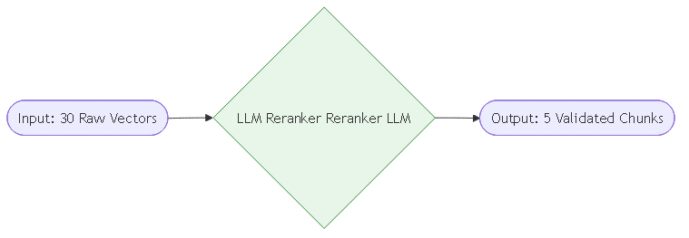
8. **Core Reasoning Synthesis (Dynamic Routing):** A discrete Complexity Analyzer logic gate dictates generation. If the query exhibits intense reasoning demands, execution overrides instantly to `openai/gpt-oss-120b`. Otherwise, it falls back to the dynamic controller's chosen model natively routing intelligently.
   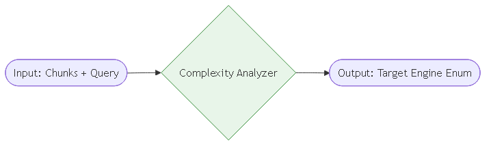
   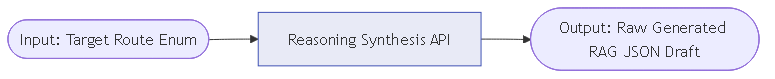
9. **Independent Fact Verifier:** A sovereign model (`Sarvam M`) audits the generated text line-by-line exclusively against the source chunks, redacting unsourced claims natively mapping visually.
   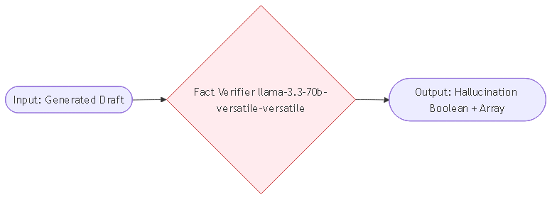
10. **Formatter & Citation Modeler:** Injects physical markdown URL and Document links natively into the structured stream response for Streamlit UI rendering.
    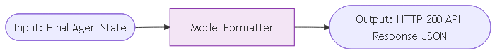
11. **Telemetry & RLHF Auditing:** Traps latency matrices, token bounds, dynamic routing models, and hallucination verdicts natively into the `audit_logs.jsonl` pipeline.

---

## 👁️ Phase 11: The Multimodality Engine

**Goal:** Provide full-scale Vision, Speech, OCR, and robust File Upload integration natively connected directly to the Chat Architecture routing dynamically to prevent structural memory crashes on low-level environments. Building an engine that reads, watches, synthesizes files, and speaks simultaneously.

### The System Pipeline
Due to massive physical memory constraints locally, the multimodality architecture required intense defensive programmatic engineering inside `app/multimodal/`, specifically accounting for massive User Payload Arrays connecting formats (PDFs, DOCX, TXT, Image, WAV) directly into the API endpoint logic without failing:

1. **The Visual Processing Unit (VPM):** Realizing that executing pristine 14.1GB parameter chunks for the standard `LLaVA 1.5 7B` model instantaneously crashed the baseline 4GB GPU environment organically, we engineered an active hardware heuristic override inside `app/multimodal/vision.py`. On low-tier systems matching `.env` configuration properties bounding `VISION_BACKEND=blip`, the backend automatically catches the exception and reroutes inference seamlessly to the extraordinarily lightweight fast 1-4GB Salesforce `BLIP` engine, saving the server. 
2. **The Fast OCR Engine:** We actively removed external Paddle dependencies entirely, moving explicit image detection matrices perfectly inside `EasyOCR`. Utilizing our pre-existing active torch bounds, EasyOCR parses the `np.ndarray` image footprints flawlessly and executes logic routing straight into our Qdrant vector arrays.
3. **Audio Synthesis & Decoupling:** Integrating both external Groq `Whisper` endpoint paths internally routing voice audio transcription (`app/api/routes.py`) and seamlessly stitching local isolated `Coqui TTS` synthesis layers generating completely native audio voice arrays without cloud latencies locally (`app/multimodal/tts.py`).

### Supported Formats Trigger Maps
- **Trigger `Image Arrays`:** When `PNG/JPEG` payloads hit the API, based on the UI `Image_Mode` toggle, the script actively pipes the data structurally to the internal Vision matrices (synthesizing "What am I looking at?") or strictly triggering an OCR sweep ("Capture exactly what this receipt says without hallucinating strings").
- **Trigger `File Arrays`:** Standard `PDF, TXT, MD, DOCX` payloads run independently inside PyMuPDF `fitz` loaders securely converting structured texts directly to vectors in milliseconds safely.
- **Trigger `Audio Arrays`:** `WAV/MP3` binaries skip the Vision parameters securely routing immediately into Whisper architectures dynamically.

### Architecture (Phase 11 Multimodal Flow)
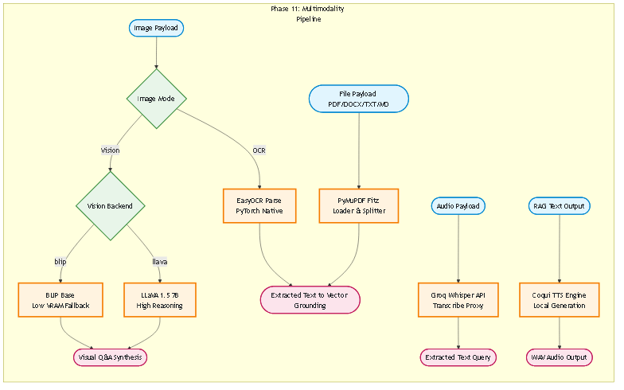

### Step-by-Step Execution Flow (Multimodal Integration)
Just like our text-based RAG architecture, here is the exact granular execution path when a Multimodal payload sweeps across the pipeline natively:

1. **Multimodal API Ingestion [Input: `UploadFile` (PNG/JPEG/WAV/PDF/DOCX) + `JSON` -> Layer: `/api/v1/chat`]**
   - The user payload enters the FastAPI gateway carrying explicitly typed binary components mapping dynamically natively.
   - 

2. **Vision/OCR Heuristic Triage [Input: `Image` + `Image_Mode` Enum -> Layer: `MultimodalRouter`]**
   - **Action:** If evaluating an image, the `file_parser` routing algorithm intelligently tests the environment UI enumerations. It routes the image to strictly read embedded text mapping (OCR) vs. deep visual reasoning explicitly.
   - 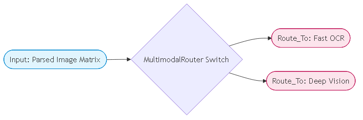

3. **Visual Synthesis Sub-DAG [Input: `Image` -> Layer: `VisionBackend`]**
   - **Action:** If Triage triggers visual logic, it validates hardware RAM constraints natively mapping. If >12GB route safely to `LLaVA`. If strictly `<6GB`, failover gracefully and execute natively to the `BLIP Sequence Captioner`. 
   - **Output [Text]:** Described objects or synthetic narrative answers explicitly attached back into the text Qdrant retrieval loops securely formatting.
   - 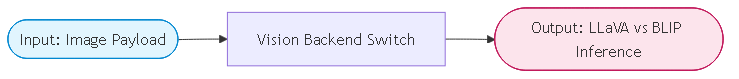

4. **OCR PyTorch Extract [Input: `Image` -> Layer: `EasyOCR`]**
   - **Action:** Triggers a high-speed tensor matrix scan executing strictly bounded boundaries isolating exact semantic characters on the physical object (i.e. spreadsheets or invoice payloads).
   - **Output [Text String]:** Re-combines matrix outputs into strictly formatted semantic sentences matching the standard PDF ingestion chunk formats securely without external C++ delays natively.
   - 

5. **Ephemeral Collection Splitting [Input: `Text String` -> Layer: `Qdrant Ephemeral DB`]**
   - **Action:** Once any data (Vision description, OCR string, or parsed PDF text) is finalized, it's exclusively deposited into a securely generated 24-hr isolated `session_id` table natively mapped inside Qdrant ensuring physical security bounds remain untouched formatting locally.
   - 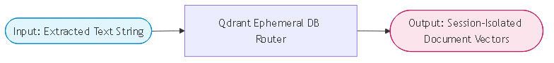

6. **RAG Orchestration [Input: Qdrant Payload -> Layer: `LangGraph Architecture`]**
   - **Action:** The text executes alongside standard Step 5 DAG workflows seamlessly integrating multimodal session insights into the final Synthesis Core LLM query dynamically evaluating heuristics.
   - 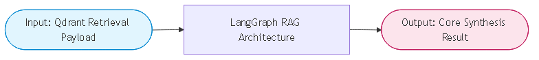

7. **Synthesized TTS Payload Exec [Input: Generated RAG Text -> Layer: `Coqui TTS`]**
   - **Action:** Locally compiles the final textual system answer into a purely native synthesized physical spoken HTTP audio payload using pre-loaded `.pth` acoustic binaries correctly avoiding any external cloud delays mapping locally seamlessly.
   - **Output [WAV Binary]:** Returned synchronously explicitly inside the frontend UI native player controls bridging API responses dynamically tracking UI outputs locally.
   - 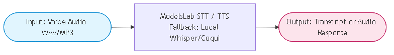

---

## 🛑 Operational Challenges & Advanced Resolutions
*The following documents critical friction points tackled during stabilization of the Enterprise Stack.*

### 1. The Windows DLL Hell & Execution Precedence
**Challenge:** Initially mapping complex mathematical libraries (`CUDA`, `CuBLAS`) across multiple submodules fundamentally broke the FastAPI server at boot executing a terminal `WinError 127: The specified procedure could not be found`. PyTorch was colliding with leftover physical DLLs from other libraries fighting for `cu11` vs `cu12`.
**Resolution:** We mapped a strict initialization sequence inside `main.py`, forcing `import torch` at line zero before any other C++-bound sub-libraries initialized. We further expanded `HardwareProbe` to violently unshift explicit NVIDIA driver paths globally into the `os.add_dll_directory` array before mapping any secondary models.

### 2. Silencing Hostile Multimodal Subprocesses
**Challenge:** While transitioning OCR logic routines, deep Subprocess architectures and HuggingFace configurations flooded the parent terminal with uncatchable verbose STDOUT warnings mapping to C++ compiler issues resulting in incredibly messy server boots.
**Resolution:** Before initializing model loads inside `file_parser.py` and `model_bootstrap.py`, we explicitly bound deep low-level OS structures wrapping standard streams in `os.dup2` file descriptor null routing. This intercepted and silenced C-level logging natively shielding the FastAPI HTTP interface visibility cleanly.

### 3. Native Reranker Logit Truncation Collisions
**Challenge:** The local BAAI Cross-Encoder executed flawlessly, predicting distances on 30 vector nodes. However, the legacy script arbitrarily bounded `score > 0.35` straight against the raw generated predictions (Logits), which mathematically represent wildly unbounded raw values.
**Resolution:** We integrated absolute `math.exp()` normalizations. The raw model bounds were directly encapsulated inside a **Sigmoid Activation Function** `probability = 1 / (1 + math.exp(-logit))` instantly correcting the unbounded logits into pristine bounded decimals `0.0 -> 1.0`.

### 4. Stateless LangGraph Execution Paths
**Challenge:** Early iterations of the FastAPI payload successfully accepted conversational `chat_history` lists from the Streamlit UI, however, the Agentic Orchestrator routinely initialized an empty semantic array into the graph on execution.
**Resolution:** The core `invoke` and `ainvoke` mappings were rewritten to natively unpack the user query and forcefully append both the user's string and the LLM's final generated logic sequentially back into the global `AgentState` dictionary before executing the final return constraint.
