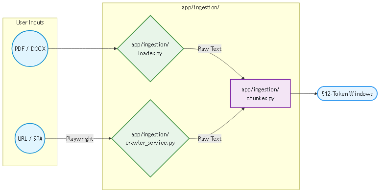
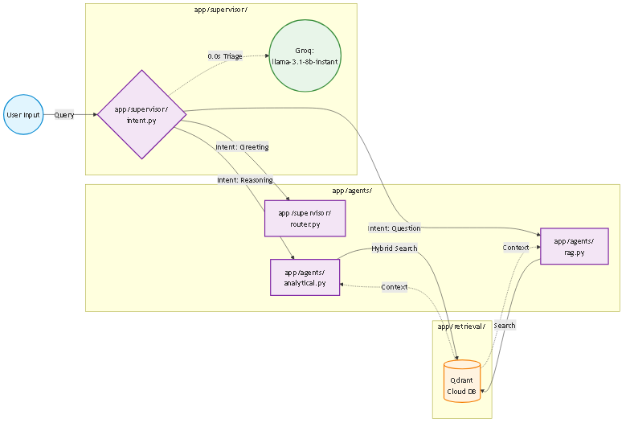
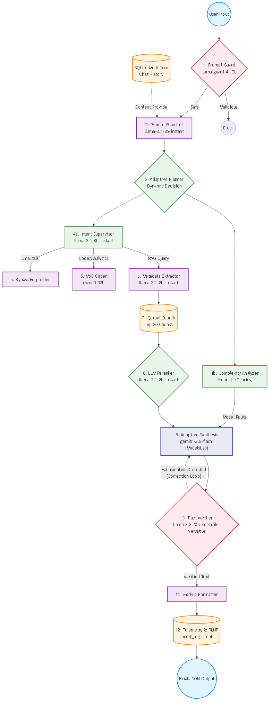

# Enterprise RAG Operations Agent

## 🚀 Project Overview
This project is a **production-grade Retrieval-Augmented Generation (RAG) system** designed to operate as an autonomous knowledge agent for enterprise environments. Unlike simple chatbots, this system focuses on **explicit orchestration**, **verifiable data ingestion**, and **operational transparency**.

It allows users to ingest complex enterprise documents (PDF, DOCX, TXT) and crawl dynamic websites, building a unified knowledge base that can be queried with high precision.

## ✨ Comprehensive Key Features
- **Deterministic Multi-Agent Orchestration**: Powered by **LangGraph** to maintain robust `AgentState` dictionaries, strictly preventing runtime hallucinations and bounding LLM logic through an explicit DAG topology.
- **Micro-Model Supervisor Routing**: Triages user intent instantly (<0.0s) using high-speed, lightweight models (`llama-3.1-8b-instant`) to either bypass the database for smalltalk or engage the heavy RAG analytics.
- **Cross-Encoder Reranking**: Utilizes `bge-reranker-large` locally to semantically filter top-30 low-confidence similarity chunks down to the absolute top 5 most relevant documents, mathematically securing the context bounds.
- **Independent Fact Verification**: Secondary LLM logic (`Sarvam M`) acts as a sovereign auditor, redacting claims generated by the Core Brain (`llama-3.3-70b-versatile`) if they cannot be verified against the native source text.
- **Dynamic Multi-Source Ingestion**: Asynchronously processes standard enterprise documents (PDF, DOCX) and executes deep web-crawls using headless **Playwright** browsers to extract dynamic text from JavaScript-heavy Single Page Applications (SPAs).
- **Token-Aware Chunking**: Abandons arbitrary word counts in favor of `RecursiveCharacterTextSplitter`, physically aligning text segments with LLM context windows to prevent data truncation.
- **Enterprise Traceability**: Fully embedded telemetry engine exporting detailed JSONL audit logs capturing every token cost, API latency, routing path, and hallucination verdict.
- **Reactive UI Portal**: Built entirely in **Streamlit**, functioning as an interactive SaaS dashboard mapping dynamic progress bars, multi-modal file uploads, and continuous background ingestion loops.

## 🏗️ Project Architecture

```text
enterprise-rag-agent/
│
├── app/             # Enterprise Vertical Slice Architecture
│   ├── api/             # HTTP layer ONLY (FastAPI endpoints, swagger definitions)
│   ├── core/            # Cross-cutting primitives (Types, exceptions, telemetry mapping)
│   ├── supervisor/      # ReAct brain (Router map, Intent Detector, Fallback logic)
│   ├── prompt_engine/   # Guardrails & Prompts (Llama-Guard, Rewriter, Templates)
│   ├── ingestion/       # Full Data Pipeline (Crawler, Loader, Chunker, Sync->Async loops)
│   ├── retrieval/       # Search Mechanics (Qdrant DB, BAAI Embeddings, Cross-Encoder Reranker, Metadata Extractor)
│   ├── agents/          # Execution Workers (RAG Agent DAG, Code Agent, Smalltalk Bypass)
│   ├── reasoning/       # Core Logic Brain (Llama-70B Synthesis, Sarvam Verifier, Citation Formatter)
│   ├── rlhf/            # Data Flywheel (Feedback Store, Reward Model logs)
│   ├── safety/          # Safeguards (Hallucination flags, Content Filters)
│   └── infra/           # Systems Infrastructure (Rate Limits, Hardware GPU Probing, DB Init)
│
├── frontend/                 # User Interface
│   └── app.py                # Streamlit Dashboard
│
├── data/                     # Root Data Persistence Storage
│   ├── crawled_docs/         # Scraped Playwright output files
│   ├── uploaded_docs/        # User uploaded manual PDFs/DOCXs
│   ├── qdrant_storage/       # Local Vector DB persist directory
│   └── audit/                # audit_logs.jsonl tracing all node vertices
│
└── tests/                    # System Verification
```

## 🛠️ Technology Stack

| Component | Tech | Reason for Choice |
| :--- | :--- | :--- |
| **Language** | Python 3.11 | Industry standard for AI/ML engineering. |
| **Orchestration** | LangGraph | State-based multi-agent orchestration for robust NLP routing. |
| **Frontend** | Streamlit | Rapid prototyping and interactive data visualization. |
| **Backend API** | FastAPI | High-performance, async-native REST API (Headless SaaS Architecture). |
| **Core Brain LLM**| Groq (`llama-3.3-70b-versatile`) | LPU architecture running at 800+ TPS. Rivals GPT-4o reasoning. |
| **Intent/Speed LLM**| Groq (`llama-3.1-8b-instant`) | Near-instantaneous intent routing and metadata extraction logic. |
| **Independent Verifier**| Sarvam AI (`sarvam-m`) | Secondary LLM layer to mathematically verify fact citations. |
| **Embeddings** | BAAI/bge-large-en-v1.5 + Reranker | State-of-the-art open-source semantic generation. |
| **Vector Store** | Qdrant | Scalable cloud-first vector index (Replaced flat FAISS files). |
| **PDF Processing** | PyMuPDF (fitz) | Fastest and most accurate text extraction for PDFs. |
| **Web Crawling** | **Playwright** + BeautifulSoup | Handles client-side JS rendering for modern SPAs. |

## 🚀 Installation & Usage

### Prerequisites
- Python 3.10+
- OS: Windows/Linux/Mac

### Setup
1.  **Clone the repository:**
    ```bash
    git clone <repo-url>
    cd Enterprise-RAG-Operations-Agent_POC
    ```

2.  **Create and activate virtual environment:**
    ```bash
    python -m venv venv
    venv\Scripts\activate
    ```

3.  **Install dependencies:**
    ```bash
    pip install -r requirements.txt
    playwright install chromium
    ```

4.  **Environment Setup (`.env`):**
    ```env
    GROQ_API_KEY=your_groq_api_key_here
    SARVAM_API_KEY=your_sarvam_api_key_here
    HF_TOKEN=your_huggingface_read_token_here
    QDRANT_API_KEY=your_qdrant_cloud_key_here
    QDRANT_URL=your_qdrant_cloud_url_here
    ```

### Running the Application

To run the full stack, you need to open two separate terminals.

5.  **Start the Backend API (Uvicorn):**
    Open your first terminal, ensure your virtual environment is activated, and run the FastAPI server:
    ```bash
    # Activate environment (if not already active)
    venv\Scripts\activate      # Windows
    # source venv/bin/activate # Mac/Linux
    
    # Start the backend server
    uvicorn app.main:app --host 0.0.0.0 --port 8000 --reload
    ```
    ✅ **Swagger API Docs:** Access the interactive endpoints at `http://localhost:8000/docs`

6.  **Start the Frontend Portal (Streamlit):**
    Open a *second* terminal window, activate the virtual environment again, and launch the UI:
    ```bash
    # Activate environment in the new terminal
    venv\Scripts\activate      # Windows
    # source venv/bin/activate # Mac/Linux
    
    # Start the Streamlit dashboard
    streamlit run frontend/app.py
    ```
    ✅ **Agent Dashboard UI:** Access the portal at `http://localhost:8501`

---

## 📈 Integration Phases

### ✅ Phase 1: Ingestion Engine
**Goal:** Build a robust, fault-tolerant ingestion pipeline strictly isolated within the `app/ingestion/` vertical slice.
- Migrated physical document loaders (`PyMuPDF`) and web scrapers into a unified ingestion stream.
- Handled complex SPA crawling natively via a highly concurrent **Playwright** implementation.
- Integrated `RecursiveCharacterTextSplitter` to handle LLM token-aware sliding window data segmentation.

#### 🏗️ Architecture (Phase 1)


---

### ✅ Phase 2: Embeddings & Qdrant Vector Store
**Goal:** Transition entirely to a managed Cloud Vector Database (Qdrant) and implement Cross-Encoder Reranking inside `app/retrieval/`.
- Executed strict L2 Cosine Distance mapping via `BAAI/bge-large-en-v1.5` embeddings on the GPU.
- Implemented `bge-reranker-large` inside `app/retrieval/reranker.py` to evaluate the Top 30 vectors and return strictly the Top 5.
- Completely abandoned legacy FAISS persistence in favor of native Qdrant payloads for enterprise multi-tenancy.

#### 🏗️ Architecture (Phase 2)


---

### ✅ Phase 3 & 4: Agentic Architecture Overhaul
**Goal:** Remove fragile procedural RAG scripts and replace them with a LangGraph multi-agent orchestrator resilient to logical exceptions.

#### 🏗️ Architecture (Phase 3 & 4)


*(The top section of the diagram illustrates the **Phase 4 Agent Implementations**, including the high-speed Groq Supervisor routing intent dynamically. The bottom section illustrates the **Phase 3 RAG Agent Refactoring**, decoupling the vector grounded extraction and synthesis into isolated LangGraph worker nodes natively in `app/agents/`.)*

#### 🛠️ Step-by-Step Implementation
1.  **State Management (LangGraph):**
    -   Implemented a strictly typed `AgentState` dictionary globally mapping `app/core/types.py`.
    -   Secures LLM conversational history, bounding the output schema to guaranteed context parameters.
2.  **Supervisor Semantic Routing:**
    -   Configured the `app/supervisor/intent.py` module using `llama-3.1-8b-instant` for explicit instant triage.
    -   Seamlessly switches execution paths between bypassing retrieval for smalltalk or initiating exhaustive agentic queries.
3.  **Specialized Domain Execution Agents:**
    -   **Smalltalk Bypass:** Natively routes via `app/supervisor/router.py` executing instant responses without querying Qdrant.
    -   **RAG DAG Execution:** Initiates `app/agents/rag.py` to chain retrieval, synthesis (`llama-3.3-70b-versatile`), and verification (`Sarvam`).
4.  **UI Alignment & Optimization:**
    -   Streamlit UI explicitly mapped to visually render the deep execution graphs dynamically as they execute in the backend.
    -   Silenced huggingface PyTorch tensor initialization outputs to keep system logs enterprise-clean.

---

### ✅ Phase 5: API-First Decoupling & SaaS Dependency Validation
**Goal:** Transition entirely into a fully headless, vertical-slice architecture where HTTP interfaces strictly decouple from core logic.
- Implemented `/api/v1/chat` and `/api/v1/ingest/crawler` completely isolated in `app/api/routes.py`.
- Constructed explicit `pydantic` request payloads, using `typing.Literal` constraints to map dynamic Swager UI dropdowns enforcing correct model execution options dynamically natively.
- Safely stripped the legacy monolithic `backend/` directory footprint out of the executable domain.

### ✅ Phase 6: Enterprise Telemetry & Independent Assertion Verification
**Goal:** Establish sovereign accountability loops auditing every node within the LangGraph DAG, alongside verifying facts line-by-line via secondary AI layers.
- Deployed a completely independent Fact Verifier node powered by `Sarvam M` residing at `app/reasoning/verifier.py` to cross-examine LLM claims organically against the source Qdrant snippets.
- Implemented JSONL audit telemetry logging all execution vertices mapping prompt costs, latencies, and hallucination logic trees explicitly for future RLHF.

---

### ✅ Phase 7: Enterprise Vector Database Upgrade (Qdrant)
**Goal:** Eliminate the scalability bottleneck of local FAISS flat-files by migrating to a managed Cloud Vector Database capable of handling high-dimensional semantic search at scale for multi-tenant isolation.
- Selected **Qdrant** for its massive "1GB Free" Cloud Tier (~1M vectors) and open-source Docker adaptability, ensuring zero-cost scaling and no vendor lock-in.
- Upgrading `app/ingestion/chunker.py` to utilize a fully token-aware `RecursiveCharacterTextSplitter`. This prevents critical data truncation that plagued the legacy 512-word methodology.
- Configuring explicit BGE `L2 Normalization` inside `app/retrieval/vector_store.py` to guarantee mathematically flawless Cosine Similarity calculations across the remote Qdrant index.

---

## 🏗️ The Complete 11-Step RAG Agentic Architecture

Below represents the exhaustive integration of the enterprise RAG standards we implemented natively into the LangGraph execution flow, strictly isolating vector similarity from intelligent reasoning.

1. **Prompt Injection & Safety Guard:** Protects the execution graph from system prompt extraction and RAG poisoning using `llama-prompt-guard-2-86m`.
2. **Prompt Rewriter / Query Expansion:** Mathematically expands ambiguous user queries (e.g., "What is it?" -> "What is the refund policy?") using historical context.
3. **Intent Detection Supervisor:** A high-speed classifier (`llama-3.1-8b-instant`) strictly routing the execution state without blocking the async API loop.
4. **Agent Dispatch / Smalltalk Bypass:** Routes trivial greetings to a lightweight responder, bypassing the expensive vector database.
5. **Dynamic Metadata Extraction:** Leverages `qwen-32b` to parse the user's natural language into strict JSON `$eq` filters, mapping directly to Qdrant payloads.
6. **Vector Similarity Search (Top 30):** Executes a high-recall L2 Cosine Distance search utilizing `BAAI/bge-large-en-v1.5` embeddings on the GPU.
7. **Cross-Encoder Reranking (Top 5):** Evaluates the top 30 chunks through a rigorous semantic cross-encoder algorithm, discarding hallucination risks and returning strictly the Top 5.
8. **Core Reasoning Synthesis:** The `llama-3.3-70b-versatile` master logical engine ingests the 5 verified chunks and structures a coherent JSON payload.
9. **Independent Fact Verifier:** A sovereign model (`Sarvam M`) audits the generated text line-by-line exclusively against the source chunks, redacting unsourced claims.
10. **Formatter & Citation Modeler:** Injects physical markdown URL and Document links natively into the structured stream response for Streamlit UI rendering.
11. **Telemetry & RLHF Auditing:** Traps latency matrices, token bounds, and hallucination verdicts natively into the `audit_logs.jsonl` pipeline.

### Visual Architecture Diagram (The Execution DAG)


